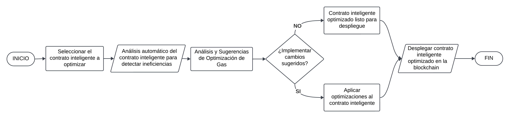

**SmartContract Optimizer Ideathon Proposal**

**Overview**

The SmartContract Optimizer plugin is designed to simplify and enhance the process of developing, deploying, and interacting with smart contracts on the Ethereum blockchain. It aims to provide developers with tools and functionalities that reduce complexity, optimize transaction costs, and streamline the development process, thereby significantly improving Developer Experience (DevEx).

**How does the project work?**

The plugin integrates directly with web3.js, offering a suite of tools that automate and optimize various aspects of smart contract development. From contract creation to deployment and interaction, it guides developers through a more efficient and error-free process.

**What problem the plugin solves?**

- Simplifies the complexity involved in creating, deploying, and interacting with smart contracts.

- Optimizes gas costs by analyzing and suggesting efficient coding practices and transaction structuring.

- Reduces the time and effort needed to develop and manage smart contracts, making blockchain development more accessible.

**How does it improve the DevEx or project functionality?**

It provides an intuitive interface and tools for developers, reducing the learning curve and technical barriers associated with smart contract development. Additionally, it ensures more robust and cost-effective dApp functionality.

**Features**

**Storage**

- Smart contract templates and best practices database.

- User’s custom contract settings and preferences for quick access and deployment.

- Historical optimization suggestions and outcomes for continuous learning and improvement.

**Functions**

- **Gas Cost Analyzer**

- Description: Analyzes smart contracts to identify potential gas optimizations.

- Steps:

1. Scan the smart contract code for common gas inefficiencies.

2. Suggest optimizations and alternative coding patterns.

3. Estimate gas savings and deploy optimized code.

- **Smart Contract Template Library**

- Description: Provides a library of optimized smart contract templates for common use cases.

- Steps:

1. Browse and select from a variety of pre-optimized contract templates.

2. Customize the template with specific project requirements.

3. Deploy the customized, optimized contract directly to the blockchain.

- **Real-time Deployment Feedback**

- Description: Offers real-time feedback and suggestions during the contract deployment process.

- Steps:

1. Analyze the contract code in real-time during deployment.

2. Provide immediate optimization suggestions before finalizing the transaction.

3. Implement suggested optimizations to reduce gas costs and improve contract performance.

**Category**

- [x] Community Plugin (general usage plugin for everyone, e.g., Multicall plugin, Tokens plugin)
- [ ] Project Plugin: (plugin to interact with an specific project, e.g, Chainlink plugin, Superfluid plugin)
- [ ] Other (specify)

**Use Cases**

- **Developer Experience**: Significantly improves the developer experience by providing tools that automate and optimize the smart contract development process, making it faster, more efficient, and less prone to errors.

- **Gas Optimization**: Offers comprehensive analysis and optimization suggestions for smart contracts, focusing on reducing gas costs and improving transaction efficiency.

**Usage (Before & After Plugin)**

- Before the plugin, developers had to manually navigate the complexities of smart contract development, often leading to higher gas costs and longer development times. Additionally, optimizing contracts for gas efficiency required deep expertise and was prone to human error.

- After implementing the SmartContract Optimizer plugin, developers can quickly select optimized contract templates, receive real-time feedback and suggestions for gas optimization, and deploy more efficient and cost-effective smart contracts. This transformation in the development process not only saves time and resources but also makes blockchain development more accessible to a wider range of developers.

